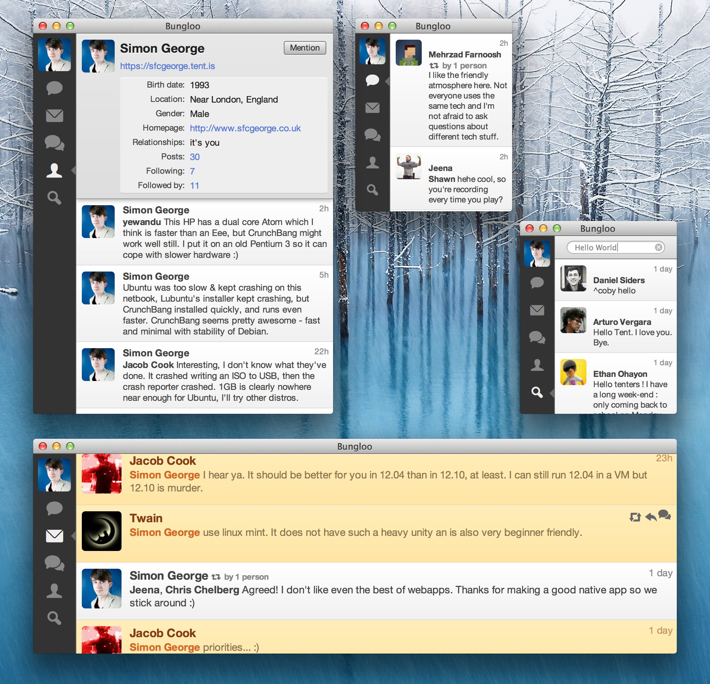

# Tenterriffic theme for Bungloo

* Tent is a [protocol](http://www.tent.io) that allows services including micro-posts like Twitter. It is different, however, in that it is distributed - no single company controlls everyone's data. You can run your own Tent server, or use a [hosted service](http://www.tent.is).
* [Bungloo](https://github.com/jeena/Bungloo/wiki) is a native Tent client app that runs on Mac, Linux, and possibly Windows soon.
* This is a CSS skin for Bungloo that is minimal and responsive.

